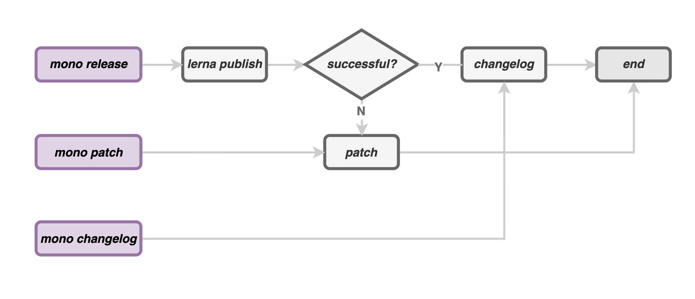
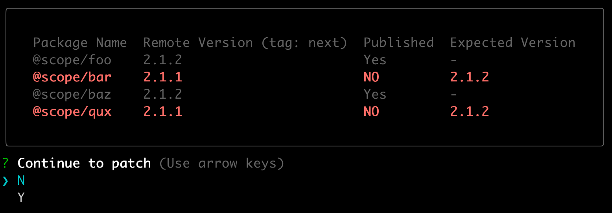

# @speedy-js/mono

[](https://npm.im/@speedy-js/mono)

Monorepo development & continuous integration tooling.

## Motivation

When we released **_monorepo_**, a headache problem was that release flow failed but some packages had been published to NPM. At this time, you may discard current release, or publish manually one by one, but it's quite troublesome in a monorepo with a large number of packages.

**mono** introduced a post `patch` process, it helps you to continue current release with visible release status.




## Features

- Restartable release flow, powered by a post `patch` release process with [visible release status](#a-complete-release-workflow).
- Quickly launch on-demand development build for monorepo.
- Generated changelog with author.

## Table of Contents

- [Install](#install)
- [Usage](#usage)
  - [A complete release workflow](#a-complete-release-workflow)
  - [Execute build after bump version](#Execute-build-after-bump-version)
  - [Independent patch process](#independent-patch-process)
  - [Generate Changelog](#generate-changelog)
    - [Attach commit author](#attach-commit-author)
    - [Create commit](#create-commit)
    - [Auto push](#auto-push)
  - [On-demand development build](#on-demand-development-build)
- [Commands](#commands)
  - [mono release](#mono-release)
  - [mono patch](#mono-patch)
  - [mono changelog](#mono-changelog)
  - [mono dev](#mono-dev)
- [FAQ](#faq)
- [Author](#author)

## Install

```bash
npm i -g @speedy-js/mono # globally
npm i -D @speedy-js/mono # as devDependencies
```

## Usage

### A complete release workflow

If you had a monorepo as:

```bash
.
├── lerna.json
├── package.json
└── packages
    ├── foo
    ├── bar
    ├── baz
    └── qux
```

If current version is `2.1.1`, after a period of time, I decide to release a patch version with `latest` version, so I execute:

```bash
mono release
```

You'll receive a prompt log to choose a release version, and you selected `2.1.2` to continue.

If release process got failed, you'll see a _**visible release status**_ under `patch` stage:

<p align="center">
  
</p>

Just select `Y` to finish release for all unpublished packages.

### Execute build after bump version

You may execute `mono release` after build packages, but if your build process generated assets that contains the version of each, you'll get a wrong version at final NPM assets, you can execute build after version is bumped:

```bash
mono release --build --ignore-scripts 
# Note that --ignore-scripts is required if you set `prepublishOnly` for sub packages.
```

### Independent patch process

Patch process has been integrated into [release flow](#a-complete-release-workflow), you can also use it separately:

```bash
mono patch --tag=latest       # launch patch process with latest tag.
```

### Generate Changelog

Changelog process has been integrated into [release flow](#a-complete-release-workflow), You can also use it separately:

```bash
mono changelog # generate changelog
```

The equivalent command under release flow is:

```
mono changelog --beautify --commit --gitPush --attachAuthor --authorNameType email
```

#### Attach commit author

```bash
mono changelog --attachAuthor
```

Commits under generated changelog will be attached with commit author:

```diff
 ### Bug Fixes
 
-* **scope:** xx ([d1cfea5](...))
+* **scope:** xx ([d1cfea5](...)) [@ULIVZ](https://github.com/ulivz)
```

#### Create commit

```bash
mono changelog --commit
```

mono will create a commit for generated changelog.

#### Auto push

```bash
mono changelog --gitPush
```

mono will create a push action to remote repository.

### On-demand development build

using `lerna run dev` will launch all dev process for all packages, using `mono dev` will launch a on-demand development build for monorepo.

```bash
mono dev
```

## Commands

### mono release

Using `mono release` to replace `lerna publish`:

```bash
mono release                  # standard release flow
mono release --no-changelog   # do not generate changelog
mono release --ignore-scripts # ignore npm scripts under release process.
mono release --dry-run        # preview execution
```

### mono patch

```bash
mono patch --tag laest      # standard release flow
mono patch --tag next       # launch patch process with next tag.
mono patch --tag latest --ignore-scripts    # Ignore npm scripts under patch process.
```

### mono changelog

```bash
mono changelog
mono changelog --beautify              # beautify changelog
mono changelog --commit                # create a commit
mono changelog --gitPush               # push to remote repository
mono changelog --attachAuthor          # add author to generated changelog
mono changelog --authorNameType email  # set display author to author's email
mono changelog --authorNameType name   # set display author to author's name
```

Recommended composable flags:

```bash
mono changelog --beautify --commit --gitPush --attachAuthor --authorNameType email
```

### mono dev

```bash
mono dev       # launch a on-demand development build for monorepo.
```

## FAQ

### I don't use lerna, can I use it?

mono leverage lerna under the hood, but you can still use it in other monorepo tool chains, such as rush.

## Author

MIT &copy; [ULIVZ](https://github.com/sponsors/ulivz)
